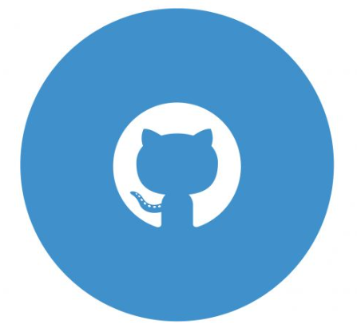

|   |   | [Achievement 🤩](./another-page.html) | [POS](./pos.html) |

## About Me 🫡

Just a curious mind exploring the world of AI and Quantum Computing. I am a Master's student at Yeshiva University, New York, pursuing Artificial Intelligence. I am passionate about Quantum Machine Learning, Scalable Machine Learning, and Phonetics and Phonology. 

#### More about me! 💭

- 🔭 I’m currently working on <b>Large Language Models and  Scalable Machine Learning 🤖</b>
- 👯 I’m looking to dive into robust <b>Quantum Machine Learning. ⚡ </b>
- 💬 Ask me about <b>food and place to find food! 🌏 </b>
- 📫 Socials: [LinkedIn](https://www.linkedin.com/in/tirth5828/)
- 😄 Fav mathematical equation: Riemann Hypothesis

## Recent Updates 🔊
- **[March 2025]** Took a session with 3rd grader telling about India as part of [Global Classroom Program](https://www.globalclassroom.onetoworld.org/) by One to World!  🎉
- **[Feb 2025]** Took part in my first in-person hackathon in USA at Georgia Tech, Atlanta. 🚀
- **[Feb 2025]** Mentored DevFeast hackathon at Columbia University, New York. 🌟
- **[Jan 2025]** Took part in the Inovation Challange at Yeshiva University, New York. 🏆
- **[Jan 2025]** Started my Master's in Artificial Intelligence at Yeshiva University, New York. 🎓

## Recent Articles 📚
- **[July 2024]** Traveling Salesman Problem Using Quantum Computing ([Read](https://medium.com/the-quantastic-journal/traveling-salesman-problem-using-quantum-computing-02ae6356544b)) in [The Quantastic Journal](https://medium.com/the-quantastic-journal) 📔
- **[July 2024]** Basics of Quantum Computing for QML ([Part 1](https://medium.com/@tirth5828/basics-of-quantum-computing-for-qml-part-1-ac0a63286580) , [Part 2](https://medium.com/@tirth5828/basics-of-quantum-computing-for-qml-part-2-a6d7da544d1d)) 📔
- **[July 2024]** Quantum Machine Learning for ML Engineers ([Read](https://medium.com/@tirth5828/quantum-machine-learning-for-ml-engineers-63c99c887ddd))📔

----

## Research Interests 🤯

- **Quantum Machine Learning:** Quantum Computing, Quantum Algorithms, Quantum Machine Learning, Quantum Natural Language Processing.
- **Scalable Machine Learning:** Large Language Models, Model Compression, Model Pruning, Model Quantization, Model Distillation.
- **Phonetics and Phonology:** Speech Recognition, Speech Synthesis, Speech Processing, Speech Enhancement, Speech Analysis.

## Skills 😎
- _Programming_: Python, C#, C++, R, Kotlin, SQL, JAVA, C
- _Backend_: Flask, Django, REST API
- _Libraries_: Pandas, Numpy, Matplotlib, Scikit-Learn, TensorFlow, LangChain
- _Database_: MySQL, Realtime Database (Firebase), ChromaDB, FAISS, Qdrant, Pinecone

## Experience 💼

- ### DZap
  **Artificial Intelligence Engineer**  
  *Sept 2024 - Present | Remote*  
  - 📈 Developing a Efficient Graph-Based Modeling and Querying of Cross-Blockchain Token Relationships
  - 🚀 Working on Integration of LLM and Natural Language Commands to Blockchain System.

- ### COMPUTELIB
  **Machine Learning Intern**  
  *June 2023 - July 2024 | Remote*  
  - 🚀 Developing an MVC web app serving as a central gateway in a microservices infrastructure.
  - 📈 Boosted app performance, reducing processing time by 12% and increasing production uptime by 43%.
  - 🛒 Contributed to e-commerce projects involving Shopify and BigCommerce.
  - 🏗️ Designed and implemented clean architecture-based microservices with support for both gRPC and REST APIs.
  - 🔧 Developed a Flask-based LLM app, implementing JWT and security features, optimizing response times to ensure delivery within a minute.
  - 🤝 Worked with Hugging Face, Open LLM, Langchain, and various vector databases like ChromaDB, Faiss, Pinecone, Qdrant.

- ### WIINGY | International Tutor 🌏
  *Oct 2022 - Dec 2022 | May 2023 - Present | Remote*

- ### INDIAN KNOWLEDGE SYSTEMS (IKS), AICTE | Technical Intern
  *Feb 2023 – March 2023 | Remote*  
  - 🎶 Worked with the Ministry of Education, Gov of INDIA on Archiving and Reviving Oral Lullabies in the Gujarati Language.
  - ⚙️ Improved user experience by optimizing the app’s Firebase code, resulting in a 23% decrease in data exchange with storage and a 12% decrease in average per-user session database download data.

- ### VERSEFI | Android Developer 📱
  *Nov 2022 – March 2023 | Remote*

## Education 👨🏻‍🎓

- **[Yeshiva University](https://www.yu.edu/katz)**  
  _Master of Science_ in _Artificial Intelligence_, 2025 - 2026, 
   
  Katz Science Fellow Scholarship
   
- **[Indian Institute of Information Technology Vadodara](https://iiitvadodara.ac.in/)**
   
  _Bachelor of Technology_ in _Computer Science and Technology_, 2020 - 2024, _CGPA: 8.08/10_
   
- **[Indian Institute of Technology Madras](https://study.iitm.ac.in/ds/)**
   
  _Bachelor of Science_ in _Data Science and Application_, 2021 - 2025, _CGPA: 8.3/10_
   
  Parallel Degree with BTech
   
  L&T TS Scholarship for Academic Excellence

## Projects 💡

- ### [HomeOnTheEdge](https://devpost.com/software/are-you-covered)
  *AI-Powered Insurance Risk Assessment*
  - 🏠 Developed an AI-powered platform to assess and mitigate financial risks for homeowners
  - 📊 Utilized machine learning models to predict the impact of natural disasters on property values
  - 📈 Integrated with insurance companies to provide real-time risk assessment and mitigation strategies

- ### [BUILD YOUR OWN STORY](https://buildstory.streamlit.app/) 📚
  *A platform to create interactive stories with images just by few clicks.*
  - 📖 Developed an engaging story creation application using advanced language models (LLMs).
  - 🖼️ Follows a branching narrative style, offering readers choices after every 2-3 paragraphs to select their desired path.
  - 📈 Images are dynamically generated using the FLUX model, with prompts crafted by LLM for a seamless storytelling experience.

- ### [PURRFECT-PAL](https://devfolio.co/projects/purrfectpal-d759) 🐾
  *Your Trusted Companion for Pet Care, Sitting, and Adoption.*
  - 🐱 Developed a comprehensive platform to connect pet owners with reliable pet care services.
  - 📅 Implemented booking and scheduling features for pet sitting services.
  - 📈 Integrated user reviews and ratings to ensure high-quality service providers.

- ### [RE ID AND REALNESS INDEX API](https://github.com/tirth5828/Re-id-and-realness) 🕵️
  *A facial recognition API required to compare two faces.*
  - 📸 Developed a robust facial recognition API to verify and compare faces.
  - 🔍 Implemented advanced algorithms to ensure high accuracy in identification.
  - 🌍 Designed to be scalable and integrable with various applications and services.

## TA🛳️s and Mentor🛳️s
- _Indian Institute of Information Technology Vadodara(IIITV)_
  - _IT:161 Computer Programming and Problem Solving_, 200+ UG students, Dec 2022 to Mar 2023, with [Dr. Bhupendra Kumar](https://iiitvadodara.ac.in/bhupendra_kumar.php).
  - _MA:201 Probability and Statistics_, 200+ UG students, Sep 2023 to Dec 2023, with [Dr. Ashish Phophalia](https://iiitvadodara.ac.in/ashish_phophalia.php).
  - _CS/IT:308, CS:612/652, CS:8XX Machine Learning_, 40+ UG and PG students, Jan to May 2024, with [Dr. Jignesh S. Bhatt](https://iiitvadodara.ac.in/jignesh_bhatt.php).

- _Indian Institute of Technology Madras(IITM)_
  - Mentor for _Programming in Python_, Aug 2022 to Sep 2022.
  - Mentor for _Maths 2_,  Sep 2022 to Dec 2022.

## Posters/Talks 🔊
- **[Aug 2023]** Talk on Riemann Zeta Function titled "[How Mathematics can break whole cryptography and make you millionaire](https://www.youtube.com/watch?v=6tQHFxjl4GQ)", IIT Madras Maths Workshop.

-----

